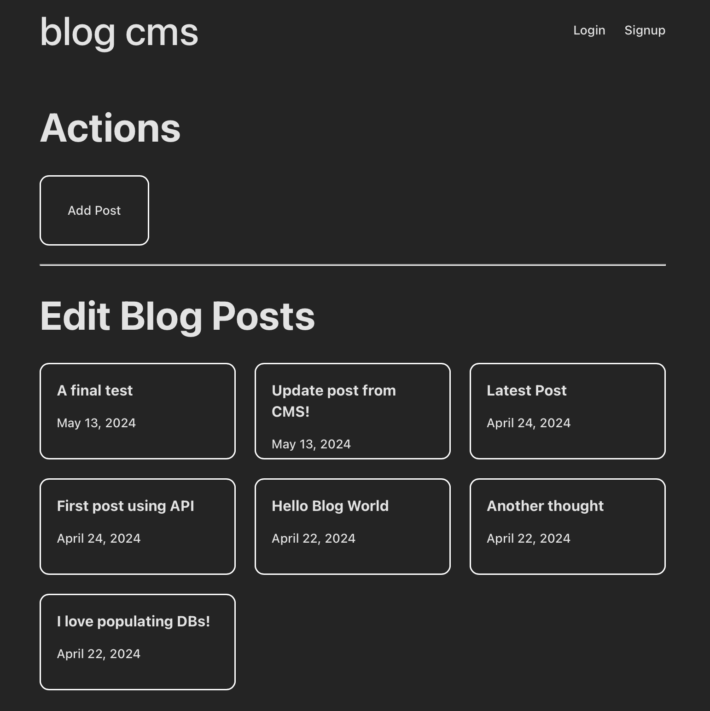
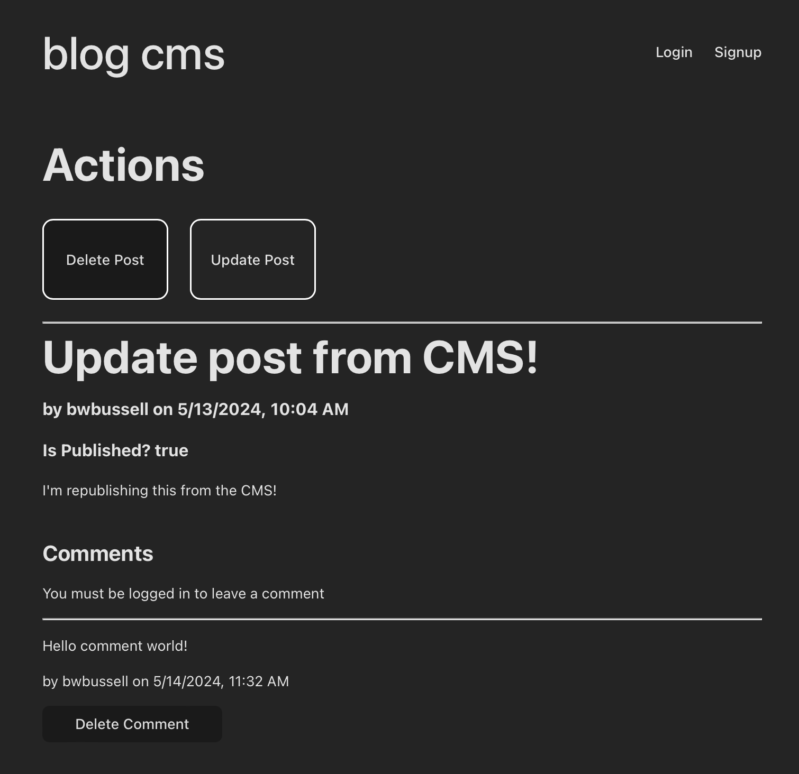

# Blog CMS

This project is a React-based content management system (CMS) built with Vite. It includes essential features for managing and displaying blog content efficiently. It was built to showcase the [Blog API](https://github.com/sourdoughbredd/blog-api).

## Description

The Blog CMS is designed to provide a seamless and efficient user experience for managing and interacting with blog posts. It uses React for the frontend framework, Vite for the development environment, and incorporates various modern web development practices. Note that since this was only developed to showcase the [Blog API](https://github.com/sourdoughbredd/blog-api), it isn't the prettiest and may have some UI bugs.

## Table of Contents

- [Description](#description)
- [Screenshot](#screenshot)
- [Preview](#preview)
- [Features](#features)
- [Installation](#installation)
- [Usage](#usage)
- [Tech Stack](#tech-stack)
- [License](#license)
- [Contact Information](#contact-information)

## Screenshot

### Home Page



### Post Updating



## Preview

You can view a live preview of the page [here](https://blog-cms-bb.netlify.app).

## Features

- JWT-based authentication
- Context API for user state management
- Conditional rendering based on user authorizations
- [Blog API](https://github.com/sourdoughbredd/blog-api) interaction
- React Router for navigation
- Responsive design

## Installation

1. Clone the repository:
   ```sh
   git clone https://github.com/sourdoughbredd/blog-cms.git
   ```
2. Navigate to the project directory:
   ```sh
   cd blog-cms
   ```
3. Install dependencies:
   ```sh
   npm install
   ```
4. Build the project:
   ```sh
   npm run build
   ```

## Usage

1. Start the development server:
   ```sh
   npm run dev
   ```
2. Open your browser and navigate to `http://localhost:3000` to view the application.

## Tech Stack

- HTML
- CSS
- JavaScript
- React + Vite

## License

This project is licensed under the MIT License.

## Contact Information

For any questions or suggestions, please contact Brett Bussell at [bwbussell24@gmail.com](mailto:bwbussell24@gmail.com).
